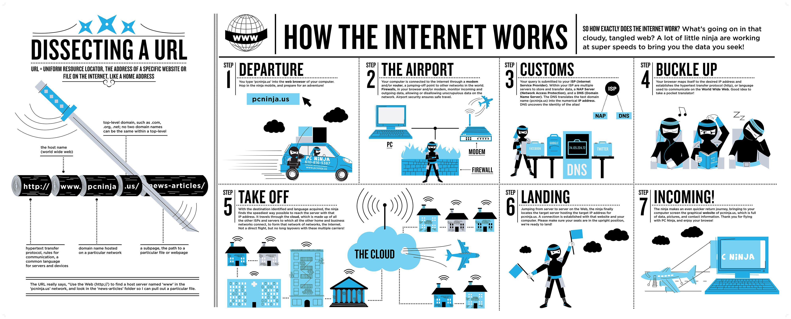

> Roadmap to becoming a System Designer :: NOOB to PRO

Below you'll find a hand full topics that you can take and the technologies that you would want to adopt in order to become a DevOps System Designer. I am learning this things from a training center; sharing them here to help the community.

***

		Announcement:
		 
		I am planing on covering the roadmaps and put more content here 

***

<h3 align="center"><strong>Purpose of these Roadmaps</strong></h3>

> The purpose of these roadmaps is to give you an idea about the landscape and to guide you if you are confused about what to learn next and not to encourage you to pick what is hip and trendy. You should grow some understanding of DevOps and System Design.

<h3 align="center"><strong>Note to Beginners</strong></h3>

> These roadmaps cover a little of System Design. Don't feel overwhelmed, It is just getting started. I am working on the beginner versions of these and will update it day by day.

***

If you think that these can be improved in any way, please do suggest.

## Day - 1

### 🎇 How Internet Works

### 🎇 UDP Packet
User Datagram Protocol (UDP) is a Transport Layer protocol. UDP is a part of the Internet Protocol suite, referred to as UDP/IP suite. Unlike TCP, it is an unreliable and connectionless protocol. So, there is no need to establish a connection prior to data transfer. 

### 🎇 OSI Model

	

